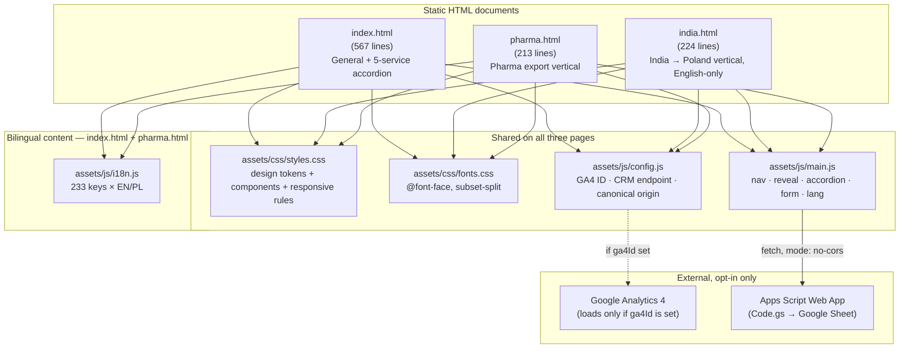
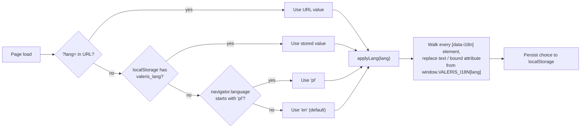
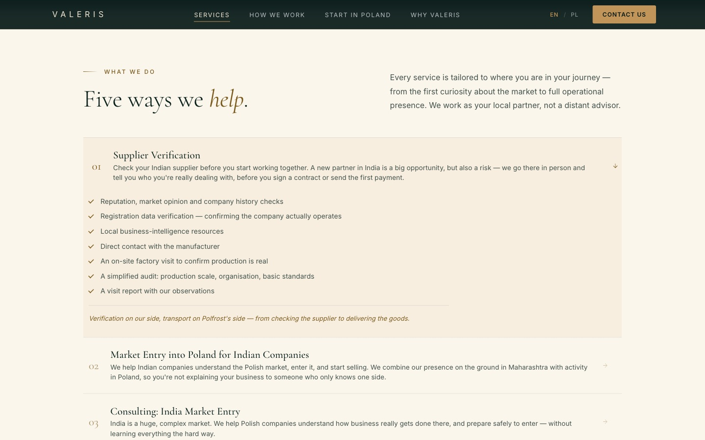
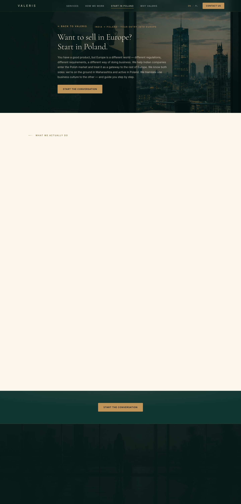
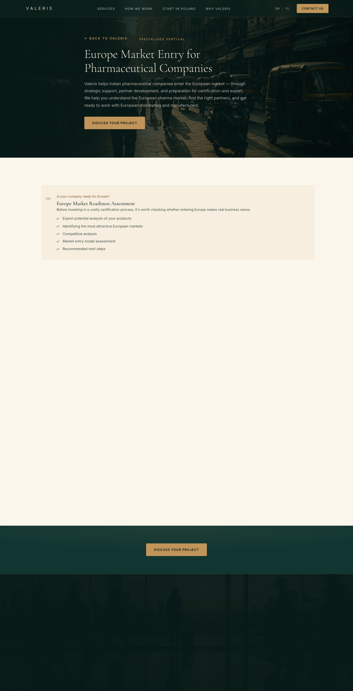

<div align="center">

# VALERIS

### A cross-border market-entry consultancy site, built as a static, dependency-free system

Three independent HTML documents — a general consultancy site, a pharma export vertical, and an India-inbound vertical — sharing one design system and one vanilla JavaScript runtime. Two of the three also share a bilingual content dictionary; the India vertical is English-only by design (it targets Indian companies, not Polish visitors). No framework, no bundler, no build step, and (by default) no third-party network requests.

[](https://developer.mozilla.org/en-US/docs/Web/HTML)
[](https://developer.mozilla.org/en-US/docs/Web/CSS)
[](https://developer.mozilla.org/en-US/docs/Web/JavaScript)
[](#5-technical-decisions)
[](#18-repository-setup)
[](#9-internationalization)
[](#8-accessibility)
[](#7-seo)
[](LICENSE)


</div>

<br>

> **What this README is for.** This is not a generic "clone and run" README. It documents the engineering of a real, three-page production site: the architectural decisions, the trade-offs that were consciously accepted instead of solved away, and the specific problems (accordion height animation without JS measurement, language switching without a layout reflow, a two-page-vertical content model that grew into three) that came up while building it. It is written for another engineer evaluating the work, not for an end user.

---

## Table of Contents

1. [Hero Highlights](#hero-highlights)
2. [About the Project](#2-about-the-project)
3. [Features](#3-features)
4. [Architecture](#4-architecture)
5. [Technical Decisions](#5-technical-decisions)
6. [Performance](#6-performance)
7. [SEO](#7-seo)
8. [Accessibility](#8-accessibility)
9. [Internationalization](#9-internationalization)
10. [Responsive Strategy](#10-responsive-strategy)
11. [Design System](#11-design-system)
12. [Engineering Challenges](#12-engineering-challenges)
13. [QA Process](#13-qa-process)
14. [Technology Stack](#14-technology-stack)
15. [Project Statistics](#15-project-statistics)
16. [Future Improvements](#16-future-improvements)
17. [Screenshots](#17-screenshots)
18. [Repository Setup](#18-repository-setup)
19. [Lessons Learned](#19-lessons-learned)

---

## Hero Highlights

- **3 pages, 1 design system, 1 shared runtime** — `index.html`, `india.html`, `pharma.html` share every line of CSS and the same `main.js` behavior layer; nothing about the visual language or interaction model is forked per page.
- **~2,200 lines of hand-written HTML/CSS/JS**, zero `npm install`, zero `node_modules`, zero build artifacts to go stale.
- **466 translated strings** (233 keys × EN/PL) resolved through one runtime function on `index.html` and `pharma.html`. `india.html` is excluded from the language system entirely — it's an English-only page for an Indian audience, not a Polish one (see [§9](#9-internationalization)).
- **Zero third-party network requests by default** — analytics and the CRM endpoint are both off until a deployer explicitly sets a config value.
- **A CSS-only accordion** that animates open/closed height without ever calling `element.scrollHeight` in JavaScript.
- **Real lead-capture pipeline**: contact form → Google Apps Script Web App → Google Sheet, with UTM/referrer/device metadata captured automatically.

---

## 2. About the Project

### The business problem

Valeris is an advisory firm operating between Poland and India's Maharashtra region. Its service is fundamentally about **trust at a distance**: a Polish importer needs to know an Indian supplier is real before wiring money; an Indian exporter needs to know how a Polish buyer actually evaluates a new partner before showing up unprepared. That's a hard thing to sell through a website, because the product *is* "we go and look, in person" — which a generic consulting-firm template cannot communicate.

The site has to do three distinct jobs for three distinct readers:

| Page | Audience | Job |
|---|---|---|
| `index.html` | Polish companies evaluating India, *and* a general entry point | Establish "we are physically there," walk through five concrete services, generate a qualified contact-form lead |
| `india.html` | Indian companies trying to reach Europe | Reframe Poland as a gateway into the EU, not just one more market |
| `pharma.html` | Indian pharmaceutical exporters specifically | Address the one vertical with materially different requirements — certification roadmaps, not just market entry |

### Target audience

Operations and business-development decision-makers at SMEs — not consumers, not a technical audience. The copy and visual register are tuned for that reader: declarative claims backed by specifics ("we visit the factory," not "we leverage our network"), no marketing fluff, no stock-photo abstraction.

### Design philosophy

The brand direction (sourced from a branding PDF, not invented) calls for a deep-green-and-gold, editorial register — closer to a private bank or a boutique M&A advisory than a SaaS landing page. Concretely, that meant a hard rule applied throughout the build: **default to the flattest version of any interaction.** No card-lift hovers, no glow, no scale transforms beyond a single 1.012× nudge on row hover. A brand built on "we don't perform, we show up" cannot have a UI that performs.

### Project goals

1. Convert a cold visitor into a contact-form submission, with enough context (UTM source, referrer, device) attached to the lead that follow-up doesn't start from zero.
2. Read as credible and senior — to a buyer evaluating a consultancy on trust, the website itself is evidence.
3. Serve three audiences without three different code bases, three different design systems, or three different translation pipelines to keep in sync.

---

## 3. Features

<table>
<tr><td valign="top" width="50%">

### User Experience
- Five-service accordion on the homepage — expand only what's relevant, no full-page scroll through content you don't need
- Sticky header with scroll-spy (active nav link tracks scroll position via `IntersectionObserver`)
- Cross-page fade transition (200ms) between `index.html` / `india.html` / `pharma.html`, skipped entirely under `prefers-reduced-motion`
- Scroll-triggered entrance reveals with per-element stagger, not a single blanket fade
- One-time animated count-up on hero statistics

### Business Features
- Lead-capture contact form with service-interest dropdown, posting to a CRM (Google Sheet) via Apps Script
- Automatic capture of UTM source/medium/campaign, referrer, device class, and timestamp on every submission — no manual context-gathering by sales
- A dedicated, audience-specific page for the pharma vertical and the India→Poland vertical, each with its own metadata, hero and service list
- A real partner-integration section (Polfrost logistics) presented as a credibility signal, not a generic "our partners" logo wall

</td><td valign="top" width="50%">

### Technical Features
- Zero runtime dependencies — no React, no jQuery, no CSS framework
- CSS custom-property design-token system shared by every component
- Grid-based accordion (no JS height measurement)
- `IntersectionObserver`-driven scroll-reveal and scroll-spy (no scroll polling)
- Config-gated analytics — Google Analytics 4 never loads unless a Measurement ID is set

### Accessibility
- Skip-link, semantic landmarks, single `<h1>` per page, non-skipping heading order
- `aria-expanded` / `aria-pressed` / `aria-controls` kept in sync with actual UI state
- `prefers-reduced-motion` neutralizes every animation site-wide with one rule

### SEO
- Canonical URLs, `hreflang` alternates, `robots.txt` + `sitemap.xml`, Organization JSON-LD (2 of 3 pages — see [§7](#7-seo) for the honest gap)

### Performance
- Self-hosted, subset-split, preloaded fonts; GPU-safe animation properties only; lazy-loaded imagery

### Internationalization
- 233 keys × 2 languages on `index.html`/`pharma.html`, resolved by one runtime function, zero markup duplication. `india.html` opts out entirely — English-only by design, not a missing translation

### Responsive Design
- Mobile-first cascade, 6 distinct pixel breakpoints, fluid type via `clamp()`

</td></tr>
</table>

---

## 4. Architecture

### Rendering strategy: three static documents, one shared runtime

There is no router and no templating engine. Each `.html` file is a complete, independently servable document — open `pharma.html` directly and it renders correctly with no dependency on having visited `index.html` first. What's shared is everything *behind* the markup: the same `styles.css` and the same `main.js` behavior layer load identically on all three pages. `i18n.js` is the one exception — it loads on `index.html` and `pharma.html` only. `india.html` doesn't include the script tag at all, by design (see [§9](#9-internationalization)).

This is the opposite of a typical SPA's mental model (one shell, many views) — it's **many shells, one logic layer**. For a 3-page marketing site that will rarely grow a fourth page, that trade favors simplicity: there's no router configuration, no client-side navigation state, no hydration mismatch class of bug. The cost — repeated `<header>`/`<footer>` markup across three files — is paid once and is mechanical to keep in sync (see [§12](#12-engineering-challenges) for how that's handled in practice).



### Folder structure

```
.
├── index.html                       General consultancy page — hero, 5-service accordion,
│                                     two-directions section, Polfrost partnership, contact form
├── india.html                       India → Poland vertical (mirrors index structure, narrower scope).
│                                     English-only by design — no i18n.js, no language switch
├── pharma.html                      Pharma export-readiness vertical (static service rows, no accordion)
├── robots.txt                       Crawl directive + sitemap pointer
├── sitemap.xml                      3 URLs, hreflang alternates, lastmod per page
├── LICENSE                          MIT
├── README.md
│
├── assets/
│   ├── css/
│   │   ├── styles.css               514 lines — :root tokens, components, 11 responsive
│   │   │                            breakpoints, 1 reduced-motion override block
│   │   └── fonts.css                17 lines — @font-face only, latin/latin-ext subsets
│   ├── js/
│   │   ├── config.js                Deployment-time constants — the only file a deployer
│   │   │                            is expected to edit
│   │   ├── i18n.js                  378 lines — window.VALERIS_I18N = { en: {...}, pl: {...} },
│   │   │                            loaded by index.html and pharma.html only
│   │   └── main.js                  254 lines — every behavior on the site, in one file
│   ├── fonts/                       16 self-hosted .woff2 files (Cormorant Garamond, Inter)
│   └── img/
│       ├── favicon.svg
│       ├── og-image.png             1200×630, used for Open Graph + Twitter Card
│       ├── polfrost-logo.png        the one real  tag on the entire site
│       └── photography/             12 JPGs — 6 motifs × 2 responsive tiers each
│
├── apps-script/
│   └── Code.gs                      doPost() handler — appends form submissions to a
│                                     'Leads' Google Sheet (16-column header, auto-created)
│
├── docs/
│   ├── specs/                       Original design/technical brief (historical record)
│   └── screenshots/                 Captures used in this README
│
├── .htaccess                        Brotli/gzip, 1-year immutable caching for css/js/woff2,
│                                     baseline security headers — Apache/cPanel target
│
└── dist/                            Gitignored deploy mirror — see §18
```

### Separation of concerns

| Layer | Lives in | Responsibility | Never does |
|---|---|---|---|
| Structure | `*.html` | Semantic markup, ARIA wiring, `data-i18n` key references | Contain hard-coded copy as the *source of truth* (it's a fallback only) |
| Presentation | `styles.css` / `fonts.css` | All visual decisions via custom properties | Contain JS-dependent state beyond simple class toggles (`.is-open`, `.is-visible`) |
| Content | `i18n.js` | Every string on the site, in two languages | Contain markup or logic |
| Behavior | `main.js` | Event wiring, language resolution, form submission, scroll observers | Render markup the HTML doesn't already provide a slot for |
| Deployment config | `config.js` | The 3 values that differ between environments | Contain anything content- or behavior-related |

### State management approach

There is no state management library and, deliberately, almost no JavaScript-held state at all. The few pieces of state that exist are either:

- **Reflected directly in the DOM** — accordion open/closed is the `.is-open` class on the `<li>`, full stop. There's no parallel JS object tracking "which row is open"; the DOM *is* the state, queried via `classList` when needed.
- **Persisted to `localStorage`** — only the language preference (`valeris_lang`). Read once on load, written once on switch.
- **Read from the URL** — `?lang=en|pl` and UTM parameters, read once and never re-parsed.

This works because the site has no concept of "session" beyond a single page view — there's nothing to coordinate across components because there are no components in the framework sense, just DOM nodes and event listeners.

### Translation architecture

Covered in depth in [§9](#9-internationalization). In short: one dictionary object, one substitution function, `data-i18n` attribute binding — no copy duplicated per language anywhere in markup.

### Asset organization

Fonts and imagery are split by *delivery mechanism*, not just by file type: `assets/fonts/` contains only files referenced from `@font-face` (never linked directly from HTML), and `assets/img/photography/` contains only files referenced from CSS `background-image` (also never linked directly — see [§5](#5-technical-decisions) for why almost every image on the site is a CSS background rather than an ``).

---

## 5. Technical Decisions

Every non-obvious choice below was made under a real constraint, not as a default. Where a decision has a genuine downside, it's stated rather than hidden.

<details>
<summary><strong>Why vanilla JS, and why no framework?</strong></summary>

<br>

The entire interactive surface of this site is: toggle a class on click, observe scroll position, substitute text on a language switch, and validate/submit a form. None of that needs a component model, a virtual DOM, or client-side state management — and pulling in React (or any framework) for it would mean shipping a runtime, a build step, and a dependency-update obligation to solve a problem this site doesn't have. For a 3-page marketing site with no client-side routing and no shared interactive state across "components" (there are no components), the framework's entire value proposition doesn't apply. `main.js` is 254 lines and does everything the site needs; that's the actual cost comparison that matters, not "frameworks are bad."

</details>

<details>
<summary><strong>Why no build step?</strong></summary>

<br>

A build step buys you bundling, minification, and transform-time correctness (TypeScript, JSX, Sass) — at the cost of a toolchain that can break, go out of date, or need a Node version pin. For three HTML files and one CSS/JS pair each, the bundling problem doesn't exist (there's nothing to bundle — it's already one file per concern), and the minification gain is marginal against `.htaccess`-level Brotli/gzip compression, which gets most of the size win for free at serve time regardless of whether the source was minified. The trade only flips once the project either grows enough pages that hand-maintained `<head>` blocks become error-prone, or needs a transform a browser can't run natively — neither is true today.

</details>

<details>
<summary><strong>Why this CSS architecture (custom properties + section-context variables)?</strong></summary>

<br>

The single hardest CSS problem on this site is that the *same* component (a heading, a kicker, a bullet list) has to render correctly on four different background treatments — `.section--dark`, `.section--band`, `.section--light`, `.section--paper` — each with different contrast requirements. Rather than writing dark/light variants of every component, each section type sets a small contract of context variables (`--hl`, `--title`, `--body`, `--hairline`, `--ec`) at its own scope:

```css
.section--dark  { --hl: var(--gold);     --title: var(--head-on-navy); --body: var(--text-on-navy); }
.section--paper { --hl: var(--gold-ink); --title: var(--ink);          --body: var(--ink-body); }
```

Every shared component then reads `var(--title)`, `var(--body)`, `var(--hl)` instead of a hard-coded color. Drop a `.kicker` or a `.section-title` into any of the four section types and it's correctly contrasted automatically — there is no `.kicker--on-dark` / `.kicker--on-light` variant pair to keep synchronized. This is the single decision that kept the component count from doubling.

</details>

<details>
<summary><strong>Why were the accordions implemented this way?</strong></summary>

<br>

The naive way to animate an accordion open is to measure `element.scrollHeight` in JavaScript and transition `max-height` to that pixel value — which works, but means re-measuring on every resize and accepting a `max-height` value that's wrong the moment content reflows (a font loading late, a translation string changing length). Instead, the detail panel transitions its own `grid-template-rows` from `0fr` to `1fr`:

```css
.row-detail { display: grid; grid-template-rows: 0fr; transition: grid-template-rows 0.45s var(--ease-reveal); }
.service-row.is-open .row-detail { grid-template-rows: 1fr; }
```

The browser computes the actual content height every frame as part of layout — there's no JS measurement to go stale. The one non-obvious requirement, documented in a code comment in `styles.css`, is that the row's padding can't live on the grid item itself: a `0fr` row with its own padding still occupies that padding's height (padding is part of the border-box regardless of content-box collapsing to zero), so it never fully closes. Padding has to live on a nested child instead, with `overflow: hidden; min-height: 0` on the wrapper in between. JavaScript's only job is `classList.toggle('is-open')` and updating `aria-expanded` — zero height math.

</details>

<details>
<summary><strong>Why background-images instead of <code>&lt;img&gt;</code> tags?</strong></summary>

<br>

Every photographic visual on the site (hero, two-direction cards, pharma/india heroes, partner rail, footer) is a CSS `background-image` on a pseudo-element, not an ``. Three reasons converged on this:

1. **They're purely atmospheric, not content.** None of these images convey information a screen-reader user needs — they're mood-setting backdrops behind text that already exists in the DOM. Implementing them as `` would mean either a meaningless empty `alt=""` (correct but adds a no-op node) or, worse, the temptation to write decorative alt text that adds noise to the accessibility tree. As CSS backgrounds, they're invisible to assistive technology by construction — no extra attribute required to get that right.
2. **The text-legibility scrim needs to layer independently of the photo.** Every photo sits behind a `::before` background-image and a `::after` gradient overlay tuned per-section for contrast against the text on top. That's a two-layer composite that's awkward to express with an `` (you'd need an extra wrapper and `position: absolute` overlay anyway) and falls out naturally from two pseudo-elements on one container.
3. **One real `` exists on the entire site** — the Polfrost partner logo — specifically *because* it's informational (a named logo, not a mood photo), so it correctly has real `alt` text, explicit `width`/`height` to prevent layout shift, and `loading="lazy"`. The choice isn't "background-images are always better," it's "match the technique to whether the image is decorative or informational," and the site only has one image in the second category.

The honest trade-off: this means responsive image delivery is a manual two-tier `min-width` swap (a 760–900px file and a 1500–2400px file per motif) rather than a real `srcset`/`sizes` negotiation — `<picture>` isn't available to a CSS background-image. For 6 motifs at 2 tiers each, that's an acceptable manual cost; it would not scale cleanly to a site with dozens of images.

</details>

<details>
<summary><strong>Why JSON-LD structured this way?</strong></summary>

<br>

The schema used is `ProfessionalService` (a subtype of `LocalBusiness`/`Organization`) rather than the generic `Organization`, because Valeris's offering is explicitly a service, not a product — `serviceType` is a first-class field on that schema and maps directly onto the five services the homepage already lists, so the structured data and the visible content stay in sync as a matter of *not duplicating effort*, rather than as two things that have to be remembered to update together. Fields without a verified answer — `foundingDate`, `sameAs` (social profiles), a registered company number — are omitted rather than filled with a plausible-looking placeholder. Search engines penalize structured data that doesn't match visible page content far more than they penalize an incomplete schema; fabricating a founding date to look more "complete" would be a worse outcome than leaving it out.

</details>

<details>
<summary><strong>Why progressive enhancement?</strong></summary>

<br>

Every `data-i18n` element ships with real English copy as its static text content — the JavaScript substitution is an enhancement on top of an already-correct page, not a requirement for the page to make sense. If `main.js` fails to load (CDN hiccup, ad-blocker false positive, a corporate proxy stripping scripts), the visitor sees a complete, readable, English page with a working `<form>` (the form still POSTs as a plain HTML form would, even though the no-JS path isn't separately wired — see [§16](#16-future-improvements)) rather than a blank shell waiting for a bundle to hydrate.

</details>

<details>
<summary><strong>Why accessibility-first, not accessibility-retrofitted?</strong></summary>

<br>

Concretely, this means decisions like the skip-link, the `:focus-visible` ring, and `aria-expanded` on the accordion trigger were written *into* the first version of each component, not added in a later pass. The cheapest time to get a focus order right is when you're writing the component once; the most expensive time is after three pages have shipped with the wrong tab order baked into the DOM order. See [§8](#8-accessibility) for what's actually implemented.

</details>

<details>
<summary><strong>Why GPU-safe animations only?</strong></summary>

<br>

Every transition and keyframe in `styles.css` is restricted to `transform`, `opacity`, `box-shadow`, `background`, and `border-color` — properties the browser can animate on the compositor thread without triggering layout (`reflow`) or paint on every frame. Nothing animates `width`, `height`, `top`/`left`, or `margin` directly (the accordion's `grid-template-rows` is the one exception, and it's a layout-affecting animation by necessity — there's no compositor-only way to animate "reveal content of unknown height," so that one cost is accepted deliberately rather than overlooked). The payoff: the hero's continuous 22-second background zoom, the scroll-reveal stagger, and the hover states all run smoothly even on a year-old mobile mid-tier device, because none of them re-run layout on every frame.

</details>

<details>
<summary><strong>Why one blanket <code>prefers-reduced-motion</code> rule instead of per-effect opt-outs?</strong></summary>

<br>

```css
@media (prefers-reduced-motion: reduce) {
  *, *::before, *::after { animation: none !important; transition-duration: 0.01ms !important; }
  [data-reveal] { opacity: 1; transform: none; }
}
```

A per-effect opt-out (checking the media query inside every individual animation) means every *new* animation added later has to remember to add its own check — a rule that's easy to forget under deadline. A single blanket override at the bottom of the stylesheet means reduced-motion compliance is structural: any animation added to this codebase in the future is covered automatically, with zero additional code at the call site.

</details>

<details>
<summary><strong>Why is <code>india.html</code> excluded from the language system, and why is one block on the homepage hardcoded English?</strong></summary>

<br>

`india.html` exists for one audience: Indian companies evaluating Poland as an entry point into Europe. That's an English-speaking B2B reader by default — a Polish translation of this page serves no one, and maintaining one would mean translating copy nobody reads while adding a code path that has to stay correct anyway. So the page doesn't carry a language switch, doesn't load `i18n.js`, and doesn't accept `?lang=`.

The non-obvious part is what "doesn't accept `?lang=`" actually required. A visitor could land on `index.html`, switch to Polish (persisted to `localStorage` as `valeris_lang`), then click through to `india.html`. If that page just ran the normal `applyLang(getInitialLang())` flow with no `data-i18n` markup to act on, `getInitialLang()` would still read the stored `pl` value and `applyLang()` would still set `document.documentElement.lang = 'pl'` on a page that is, and reads as, entirely English — a real `lang` mislabel for assistive technology and search engines, not just a missing translation. The fix is a single guard in `main.js`:

```js
var IS_INDIA_PAGE = (location.pathname.split('/').pop() || 'index.html') === 'india.html';
// ...
if (IS_INDIA_PAGE) {
  document.documentElement.lang = 'en';
} else {
  applyLang(getInitialLang());
}
```

One boolean, checked at the two call sites that matter (language-button wiring and the init call), rather than a `data-i18n` audit page-by-page. The same audience logic shows up once more, in miniature: the homepage's bottom-of-page CTA ("Indian company looking at Poland?") stays English even when the rest of `index.html` is rendered in Polish, because it's the same Indian-company pitch, just placed where a Polish reader scrolling the homepage will also see it. That block simply has no `data-i18n` attributes — `applyLang()` only ever touches elements that carry one — plus an explicit `lang="en"` on the container so a screen reader announces it correctly even while the surrounding document is `lang="pl"`.

</details>

---

## 6. Performance

| Concern | Implementation |
|---|---|
| **Lazy loading** | The one real `` (Polfrost logo) carries `loading="lazy"`; all other imagery is CSS `background-image`, which browsers already defer until the element is in the render path |
| **Image strategy** | 6 photographic motifs, each shipped at 2 tiers (a ~70–130KB mobile file and a ~200–580KB desktop file) swapped via `min-width` media queries — only one tier ever downloads per device, never both |
| **Rendering performance** | No virtual DOM, no client-side router, no hydration — the only JS cost is parsing and running ~660 lines across `config.js` + `i18n.js` + `main.js` (`i18n.js` only on `index.html`/`pharma.html`), all `defer`red |
| **Animation performance** | Restricted to compositor-safe properties (`transform`/`opacity`/`box-shadow`/`background`/`border-color`) — see [§5](#5-technical-decisions) |
| **Repaint avoidance** | Scroll handling uses a single `{ passive: true }` listener purely for a header-state class toggle; all reveal/scroll-spy logic runs through `IntersectionObserver`, which doesn't poll on the main thread at all |
| **Layout stability** | The one `` ships explicit `width`/`height`; background-image layers are `position: absolute; inset: 0` inside already-sized containers, so no image load can shift surrounding content |
| **Responsive assets** | Two-tier photography swap (above); `unicode-range`-subset fonts so a browser only fetches the glyph set the rendered language needs |
| **Font loading** | Self-hosted `woff2`, `font-display: swap` (text renders immediately in a fallback face, swaps when the webfont arrives — no invisible-text flash), with the two weights used in the hero's first paint marked `<link rel="preload">` |
| **Third-party requests** | Zero by default. GA4's `gtag.js` is only injected if `assets/js/config.js`'s `ga4Id` is non-empty; with it empty (the shipped default), the page makes no analytics request at all |

**Core Web Vitals, by construction:**
- **CLS (layout shift)** — structurally close to zero: no `` without explicit dimensions, no late-injected DOM above the fold, no font-swap-induced reflow of any element that affects surrounding layout (the swap changes glyph rendering, not box size, because `font-display: swap` keeps the same fallback metrics until paint).
- **LCP (largest contentful paint)** — the hero headline is text, not an image, and its font is preloaded; the hero background photo loads in parallel and is layered *behind* already-rendered text, so it is not the LCP-blocking element.
- **INP/FID (interactivity)** — no long-running JS on load; the heaviest operation (the i18n substitution pass) walks `[data-i18n]` elements once, on `DOMContentLoaded`, and is not in any way a recurring cost.

> Internal QA logged Lighthouse scores of 100/100/100/100 (desktop) and 89–100/100/100/100 (mobile) across iterations during development (see `PROJECT_STATUS.md`). Those numbers predate the photography integration documented in this README and were not re-measured for this revision — they're cited here as a record of methodology, not as a live guarantee. A fresh audit before each deploy is cheap and is listed in [§16](#16-future-improvements).

---

## 7. SEO

| Implemented | Detail |
|---|---|
| **Per-page metadata** | Unique, keyworded `<title>` and `<meta name="description">` per page — never a single generic pair reused across `index.html` / `india.html` / `pharma.html` |
| **Canonical URLs** | `<link rel="canonical">` on every page, self-referencing |
| **`hreflang`** | `en`, `pl`, and `x-default` alternates on `index.html` and `pharma.html`; `en` and `x-default` only on `india.html` — it has no Polish variant to advertise, by design (see [§5](#5-technical-decisions)). Matched exactly in `sitemap.xml` |
| **`robots.txt`** | `Allow: /` for all agents, with an explicit `Sitemap:` pointer |
| **`sitemap.xml`** | All 3 URLs, each with `hreflang` alternates, `lastmod`, and a deliberately differentiated `priority` (`1.0` home, `0.9` India vertical, `0.8` pharma vertical) |
| **JSON-LD** | `ProfessionalService` structured data on `index.html` and `india.html` — see the honest gap below |
| **Open Graph** | `og:type`, `og:site_name`, `og:title`, `og:description`, `og:url`, `og:image` (+ explicit width/height), `og:locale`, on all 3 pages; `og:locale:alternate` on `index.html`/`pharma.html` only, for the same reason as the `hreflang` row above |
| **Twitter Cards** | `summary_large_image` card on `index.html` — see the honest gap below |
| **Semantic HTML** | Landmark elements (`header`/`nav`/`main`/`footer`), one `<h1>` per page, non-skipping heading order |
| **Internal linking** | Every page cross-links the other two by name (not just "home") — e.g. the homepage's Polfrost section links to `india.html` with anchor text "Start in Poland," not a bare URL |
| **Accessibility ↔ SEO overlap** | Semantic structure and a non-skipping heading hierarchy serve both screen readers and search-engine content parsing simultaneously — see [§8](#8-accessibility) |

**Honest gaps, stated rather than hidden:**
- `pharma.html` does not currently carry a JSON-LD block — `index.html` and `india.html` do. This is a real inconsistency, not an intentional differentiation, and is the top item in [§16](#16-future-improvements).
- Twitter Card tags exist on `index.html` only; `india.html` and `pharma.html` rely on Open Graph alone for social-preview rendering (most platforms, including Twitter/X itself, fall back to OG tags when Twitter-specific tags are absent — so the practical impact is small, but it's an inconsistency worth naming).
- The canonical/`hreflang` URLs are written against `valeris.com.in` per a code comment in `config.js` flagging that the final production domain (`.com` vs `.com.in`) was still being confirmed at time of writing — shipping SEO tags against an unconfirmed domain is a known, explicit risk, not an oversight.

---

## 8. Accessibility

| Area | Implementation |
|---|---|
| **ARIA** | `aria-expanded` (accordion, mobile menu), `aria-pressed` (language toggle), `aria-controls`, `aria-label` on icon-only controls, `role="status" aria-live="polite"` on the form's feedback region, `role="group"` on the language switch |
| **Keyboard navigation** | Skip-link as the first focusable element; accordion triggers, hamburger, and language toggle are real `<button>` elements (native keyboard activation, no `div onclick`); `Escape` closes the open mobile menu |
| **Focus management** | A single, consistent `:focus-visible` style (2px outline, 3px offset) applied globally — no component suppresses or replaces the default focus indicator with something weaker |
| **Screen readers** | Decorative SVG motifs marked `aria-hidden="true"`; two `.sr-only` paragraphs per page carry AI/SEO-oriented descriptive sentences invisible to sighted users but available to assistive tech and crawlers |
| **Reduced motion** | One blanket `prefers-reduced-motion: reduce` override neutralizes every animation/transition site-wide — see [§5](#5-technical-decisions) |
| **Semantic HTML** | `<header>`, `<nav aria-label="Primary">`, `<main id="main">`, `<footer>`, `<address>` for contact details — landmark-correct throughout |
| **Color contrast** | Section-context color variables (`--title`, `--body`, `--hl`) are chosen per background to keep text AA-readable on every section type, including the gold-on-cream case (`--gold-ink`, a darkened gold specifically for legibility on light backgrounds — distinct from `--gold`, the lighter value used on dark backgrounds) |
| **Forms** | Every input has a visible, associated `<label>`-equivalent text element; required-field and email-format validation produce a text message in the live-region status element rather than a browser-default popup alone; `:user-invalid` styling gives a visual cue without relying on color alone (border *and* background shift together) |

---

## 9. Internationalization

This section describes `index.html` and `pharma.html`. `india.html` does not run any of it — see [§5](#5-technical-decisions) for why.

### The system



All copy lives in one object, `window.VALERIS_I18N = { en: {...}, pl: {...} }` (`assets/js/i18n.js`, 378 lines, 233 keys per language). Markup never embeds language-specific copy as its source of truth:

```html
<h1 class="hero-title" data-i18n="hero.line1">We don't sell consulting.</h1>
```

The English text inside the tag is a **real fallback**, not a placeholder — if `i18n.js` fails to load, the page is still a complete, readable English page. It is not the rendered source of truth once JavaScript runs: `applyLang()` walks every `[data-i18n]` element on load and replaces its `textContent` (or, for elements flagged `data-i18n-attr="content"`, a specific attribute — used for `<meta name="description">`) with the dictionary value for the active language.

### Language switching

Clicking `EN` / `PL` calls the same `applyLang()` function used on initial load. Because it only ever swaps `textContent`/attributes on elements that already exist in the DOM — never adding, removing, or repositioning a node — there is no layout recalculation beyond ordinary text reflow. Switching languages mid-session produces no flash, no jump, and no flicker.

### Fallback strategy

Resolution priority, checked in order: **URL `?lang=` parameter → `localStorage` → `navigator.language` → English.** A missing key for the active language falls back to the English value for that key, and if that's also missing, falls back to the literal key string — the page never renders a blank string or `undefined`, even for a key that hasn't been translated yet.

---

## 10. Responsive Strategy

The CSS is mobile-first: base rules target the smallest viewport, and `min-width` blocks layer refinements on top — never the reverse. Six distinct pixel breakpoints appear across 11 `@media` blocks in `styles.css` (plus one `prefers-reduced-motion` block, which is breakpoint-independent):

| Breakpoint | Direction | What changes |
|---|---|---|
| `360px` | `max-width` | Header gap tightening only — below this width the wordmark + language switch + hamburger stop fitting their default gaps |
| `640px` | `max-width` | The mobile tier proper: stacked layouts, full-width CTAs, single-column grids, 16px form inputs (prevents iOS auto-zoom-on-focus), reduced section padding |
| `641px` | `min-width` | Hero vertical-rhythm tier — tightens hero top padding and internal margins so the metrics row and scroll cue clear common laptop viewport *heights* (864–900px), independent of width |
| `760px` | `min-width` | Two-direction card photography swaps to its higher-resolution tier |
| `900px` | `min-width` | The tablet/desktop split: mobile nav reverts to inline nav, hamburger hides, several photography motifs swap to their high-resolution tier |
| `980px` | `max-width` | Multi-column sections (`why-list`, `footer-inner`, `process-steps`) collapse from 4 columns to 2 |

**Fluid typography**: headline and section-title sizes use `clamp()` rather than fixed breakpoint jumps — e.g. `font-size: clamp(2.85rem, 6vw, 5.4rem)` on the hero title scales continuously with viewport width between a floor and a ceiling, instead of stepping abruptly at each breakpoint.

**A deliberate non-obvious decision**: the `641px` breakpoint targets viewport *height* behavior (hero rhythm) on a `min-width` query, not a height-based media query. This was a conscious trade — `min-height` queries interact badly with mobile browsers' dynamic toolbar resizing (the viewport height changes as the user scrolls, on some mobile browsers, without the page actually changing size), so the rhythm fix is scoped by width instead, accepting that it applies uniformly above 641px width rather than precisely targeting "short viewports" everywhere.

---

## 11. Design System

### Colors

All five base colors are sourced verbatim from a branding PDF, not invented or approximated — the source-of-truth comment lives directly in `styles.css`:

| Token | Hex | Role |
|---|---|---|
| `--navy-deep` | `#071917` | Primary dark field |
| `--navy-mid` | `#113632` | Dark teal-green bands |
| `--green` | `#2F5C3F` | Secondary accent |
| `--accent` / `--gold` | `#C19559` | Brand gold — actions, highlights, on dark backgrounds |
| `--canvas` | `#F1E4D1` | Warm cream — light sections |
| `--gold-ink` | `#7A5A1C` | Darkened gold — used *only* where gold sits on a light background, for AA contrast |

Every other color in the system (`--accent-strong`, `--navy-soft`, glow rgbas) is a documented derivation of one of the five base values — e.g. `--navy-soft: #173E37` is commented as "~35% interpolated between `--navy-mid` and `--green`," not a sixth invented brand color.

### Spacing & layout

A single `--maxw: 1180px` content cap and a `.container` component with `padding: 0 2.5rem` (reduced to `1.3rem` under 640px) are the only layout primitives — sections vary their *vertical* rhythm (`7.25rem` desktop padding, `4.5rem` mobile) but never introduce a second content-width system.

### Typography

| Token | Stack | Used for |
|---|---|---|
| `--font-display` | Cormorant Garamond → Georgia → Times New Roman → serif | Headlines, the editorial register |
| `--font-body` | Inter → system-ui → -apple-system → Segoe UI → Roboto → sans-serif | Body copy, UI text, the functional register |

The serif/sans split is deliberate: headlines get an editorial, slightly literary voice (italic emphasis spans, `font-weight: 300`), while anything functional (buttons, labels, nav) stays in a neutral grotesque for maximum legibility at small sizes.

### Motion

| Token | Value | Used for |
|---|---|---|
| `--ease` | `cubic-bezier(0.4, 0, 0.2, 1)` | Standard UI transitions (hover, focus) |
| `--ease-reveal` | `cubic-bezier(0.2, 0, 0.1, 1)` | Entrance reveals — "confirms content arrived, never performs" (code comment, verbatim) |
| `--t` | `0.4s var(--ease)` | Default transition duration |
| `--t-reveal` | `0.65s var(--ease-reveal)` | Scroll-reveal duration |

### Buttons, cards, components

- **Buttons** — two variants only: `.btn-primary` (solid gold, dark text) and `.btn-ghost` (outlined). No tertiary/link-button variant was needed.
- **Cards** (`.ei-card`, `.partner-box`, `.usp-card`) — share a hover contract of border-color and background-gradient shifts only; nothing lifts, scales beyond 1.012×, or glows.
- **Section-context variables** (`--hl`, `--title`, `--body`, `--hairline`, `--ec`) — the mechanism that lets every shared component render correctly on 4 different background types without a single dark/light variant pair. See [§5](#5-technical-decisions) for the full rationale.

---

## 12. Engineering Challenges

<details>
<summary><strong>Accordion architecture — animating to an unknown height without JavaScript measurement</strong></summary>

<br>

**Problem**: the homepage's 5 services each have a substantial detail panel (a bullet list plus 2 paragraphs) that should expand/collapse on click. The standard JS approach — read `scrollHeight`, transition `max-height` to that value — is fragile: it has to re-run on resize, and it's wrong for one frame whenever content reflows (e.g., a late-loading font changing line count).

**Solution**: animate `grid-template-rows` from `0fr` to `1fr` instead of `max-height`. The browser recomputes the actual row height as part of normal layout on every frame, so there's never a stale measurement. The one trap: a `0fr` grid row still occupies its own padding (padding is part of the border-box regardless of the row's content-box collapsing to zero), so naively putting padding on the animated element itself means it never fully closes. The fix — push padding to a nested child, with `overflow: hidden; min-height: 0` on the wrapper between — is documented as an inline code comment specifically because it's the kind of thing a future editor would otherwise "fix" by moving padding back up and silently breaking the collapse.

</details>

<details>
<summary><strong>Scroll reveal — staggering without a fixed-duration delay queue</strong></summary>

<br>

**Problem**: revealing every `[data-reveal]` element the instant it's 12% visible, all at once, reads as a single abrupt flash rather than a considered entrance — but a *fixed* per-element stagger (delay = index × 70ms) breaks down for a section with many elements, where the last item would wait an absurdly long time after the section is already fully on screen.

**Solution**: `Math.min(i * 70, 280)` — the stagger grows linearly for the first few elements, then caps at 280ms regardless of how many elements follow. The visual effect (a brief, considered cascade) is preserved for small groups, and large groups never produce a multi-second tail of elements still fading in well after the user has scrolled past them.

</details>

<details>
<summary><strong>The India vertical — discovering a third page mid-build</strong></summary>

<br>

**Problem**: the project began as a two-page site (`index.html` general + `pharma.html` vertical). Partway through, it became clear Indian companies looking to enter Europe needed their own entry point — "Poland as a gateway to the EU" is a different pitch from "we verify suppliers for you," and burying it as a subsection of the homepage undersold it.

**Solution**: `india.html` was built reusing the exact same page skeleton (`.row-grid` service list, `.section--*` context system, footer/header markup) as the other two pages — because the design system was already factored into reusable tokens and components rather than page-specific styles, adding a third page cost zero new CSS components, only new content. The one asset gap — no dedicated India-hero photograph had been supplied — was resolved by deliberately reusing the "Europe gateway" card photography for the India hero background, documented as an explicit code comment (`/* reuses the EU/India gateway photography — no dedicated India-page image was supplied */`) rather than silently repurposing an asset and leaving a future editor to wonder why.

</details>

<details>
<summary><strong>Image strategy — picking the right technique per image, not one technique for all images</strong></summary>

<br>

**Problem**: the site needed atmospheric, brand-appropriate photography across 6 different sections without either bloating page weight or compromising accessibility semantics.

**Solution**: every photo was classified as decorative (no ``, CSS background, invisible to the accessibility tree by construction) versus informational (the one case — the Polfrost logo — got a real `` with real `alt` text). For the decorative set, each of the 6 motifs ships at exactly 2 file sizes (a sub-130KB mobile tier and a 200–580KB desktop tier), swapped via `min-width`, rather than a single large file always loaded or a full `srcset` negotiation a CSS background can't use anyway. This is detailed further in [§5](#5-technical-decisions).

</details>

<details>
<summary><strong>Navigation — keeping three pages' header/footer markup honest without a templating engine</strong></summary>

<br>

**Problem**: with no shared layout/include mechanism, the header and footer markup is physically duplicated across all three HTML files. The obvious risk is drift — a nav link added to one page and forgotten on the other two.

**Solution**: there's no clever technical fix for this without introducing a build step (which was deliberately avoided — see [§5](#5-technical-decisions)); the honest mitigation is that the header/footer are kept *structurally* trivial (a handful of `<a>` tags, no per-page logic) specifically so that "copy this block to the other two files" is a low-risk, mechanical edit rather than something requiring judgment. This is a real, named trade-off, not a solved problem — see [§19](#19-lessons-learned) for how it would change if the page count grew further.

</details>

<details>
<summary><strong>Localization — supporting two languages without two copies of every page</strong></summary>

<br>

**Problem**: the standard "easy" way to ship a bilingual site is two physical page trees (`/en/`, `/pl/`) — simple to reason about, but doubles every future edit and creates exactly the drift risk the templating problem above already accepts in miniature.

**Solution**: covered in full in [§9](#9-internationalization) — one dictionary, one substitution pass, `data-i18n` binding. The page count stays at 3, not 6. One page, `india.html`, opts out of this system entirely rather than running it for an audience it doesn't serve — see [§5](#5-technical-decisions) for why and for the `localStorage`-leak edge case that opt-out had to account for.

</details>

<details>
<summary><strong>Mobile navigation — keeping a fixed-position menu accessible</strong></summary>

<br>

**Problem**: a typical mobile slide-out menu implementation either traps focus incorrectly, fails to restore `aria-expanded` state on outside interaction, or leaves the page scrollable behind an open overlay (letting a user accidentally interact with content underneath).

**Solution**: opening the mobile menu sets `document.body.style.overflow = 'hidden'` for the duration it's open, keeps `aria-expanded`/`aria-label` ("Open menu" ↔ "Close menu") in sync with the toggle's actual state, and an `Escape` keydown listener closes it from anywhere on the page — not just via the hamburger button itself.

</details>

<details>
<summary><strong>SEO implementation — structured data that can't drift from visible content</strong></summary>

<br>

**Problem**: structured data that's hand-written separately from the visible page content drifts over time — someone updates the five visible services and forgets the JSON-LD `serviceType` array still lists the old four.

**Solution**: not fully automated (there's no build step to generate one from the other), but the JSON-LD's `serviceType` array was written to directly mirror the same five service titles used in the visible accordion, in the same order — a discipline choice rather than a structural guarantee. The honest caveat: this is exactly the kind of thing a future content edit could silently desync, which is why it's named here rather than presented as solved.

</details>

---

## 13. QA Process

| Check | Method |
|---|---|
| **Multi-viewport visual verification** | Captured and reviewed at common laptop heights (1440×900, 1536×864, 1920×1080) specifically because the hero's above-the-fold content (metrics row, scroll cue) is the layout most sensitive to viewport *height*, not just width |
| **Responsive testing** | Verified at mobile (390px), tablet (834px), and desktop (1440px+) widths; the screenshots in [§17](#17-screenshots) were captured directly from these passes |
| **Bilingual parity** | Every visible-copy change checked in both EN and PL — including string-length-driven layout effects (Polish strings run longer than their English equivalents in several places) |
| **Accessibility review** | Manual keyboard-only pass (skip-link, accordion, mobile menu, language switch, form) confirming every interactive element is reachable and operable without a mouse |
| **SEO validation** | Manual review of canonical/`hreflang`/JSON-LD/OG output per page against the live rendered `<head>` — this is also how the pharma.html JSON-LD gap and the Twitter Card inconsistency documented in [§7](#7-seo) were identified |
| **Console audit** | Browser console checked for runtime errors/warnings across pages and languages |
| **Overflow audit** | Checked for horizontal scroll/clipped content at narrow viewports, particularly around the accordion's collapsed-state padding (see [§12](#12-engineering-challenges)) |
| **Manual QA** | Full click-through of every interactive element — accordion open/close, mobile menu open/close, language toggle, all internal nav links, contact form validation (empty fields, malformed email) and submission states (sending / success / error) |

This is a manual, engineer-led QA process rather than an automated test suite — there is no CI pipeline and no headless test runner wired into this repository today. That's a real gap, not a strength, and is named explicitly as the first item in [§16](#16-future-improvements) and discussed in [§19](#19-lessons-learned).

---

## 14. Technology Stack

| Category | Technology | Notes |
|---|---|---|
| Markup | HTML5 | Semantic landmarks, `data-i18n` / `data-i18n-attr` custom attributes |
| Styling | CSS3 | Custom properties, CSS Grid, `clamp()`, `:has()` (process-steps connector line), `prefers-reduced-motion` |
| Behavior | Vanilla JavaScript (ES5-leaning syntax, no transpilation needed) | No framework, no build step |
| Structured data | JSON-LD (`schema.org/ProfessionalService`) | On `index.html`, `india.html` |
| Social metadata | Open Graph, Twitter Cards | OG on all 3 pages, Twitter on `index.html` |
| Observers | `IntersectionObserver` | Scroll-reveal, scroll-spy nav, used in place of scroll-position polling |
| Fonts | Self-hosted `woff2` — Cormorant Garamond, Inter | `unicode-range` subset-split, `font-display: swap`, critical-weight preload |
| Forms/backend bridge | Google Apps Script (`Code.gs`) | `doPost()` handler writing to a Google Sheet |
| Analytics | Google Analytics 4 (`gtag.js`) | Conditionally loaded — config-gated, off by default |
| Hosting target | Static file hosting (Apache/cPanel via `.htaccess`; equally deployable to Netlify/Vercel/GitHub Pages/S3) | No server runtime required |
| Version control | Git / GitHub | [`magradzef-zick/valeris-website`](https://github.com/magradzef-zick/valeris-website) |
| License | MIT | © Valeris Group Private Limited |

---

## 15. Project Statistics

| Metric | Count |
|---|---|
| Pages | 3 (`index.html`, `india.html`, `pharma.html`) |
| Total hand-written lines (HTML + CSS + JS) | ~2,200 (567 + 224 + 213 HTML · 514 + 17 CSS · 254 + 378 + 31 JS) |
| Languages supported | 2 (English, Polish) on `index.html`/`pharma.html`; `india.html` is English-only by design |
| i18n keys | 233 per language (466 dictionary entries total), used by `index.html` and `pharma.html` |
| Responsive breakpoints | 6 distinct pixel values across 11 `@media` blocks, + 1 `prefers-reduced-motion` block |
| Structured data blocks | 2 of 3 pages (`index.html`, `india.html`) |
| Real `` tags, site-wide | 1 |
| CSS background-image motifs | 6, each at 2 responsive tiers (12 JPG files total) |
| Self-hosted font files | 16 `.woff2` files (2 typefaces × weights × latin/latin-ext subsets) |
| JS dependencies | 0 |
| Build-time dependencies | 0 (`package.json` does not exist in this repository) |
| Distinct animation keyframes | 9 (`pageFadeIn`, `heroPhotoZoom`, `heroIn`, `cueIn`, `arcDraw`, `nodeIn`, `nodePulse`, `gridDrift`, `scrollPulse`) |
| Accessibility-specific affordances | Skip-link, global `:focus-visible`, `aria-expanded`/`aria-pressed`/`aria-controls` wiring, `role="status"` live region, blanket reduced-motion override |
| SEO mechanisms implemented | Canonical, hreflang (3 alternates on 2 pages, 2 on `india.html` by design), robots.txt, sitemap.xml, JSON-LD, Open Graph, Twitter Cards (partial), semantic heading hierarchy |

---

## 16. Future Improvements

Ordered by what would actually move the needle, not alphabetically:

1. **Close the `pharma.html` JSON-LD gap.** The simplest, highest-leverage fix in this entire list — `index.html` and `india.html` already have a working `ProfessionalService` block to copy from.
2. **Confirm the production domain and re-verify canonical/`hreflang`/sitemap URLs against it.** `config.js` flags this as unresolved (`.com` vs `.com.in`); every absolute URL in the SEO layer depends on this being settled once, correctly.
3. **Add Twitter Card tags to `india.html` and `pharma.html`** for consistency with `index.html`, even though most consuming platforms already fall back to Open Graph.
4. **Introduce a minimal automated check** — even a single Playwright script that loads each page, asserts no console errors, and snapshots key viewports — to catch the kind of visual regression this project currently only catches by manual review (see [§13](#13-qa-process)).
5. **Automate the `dist/` sync** rather than keeping it as a manual file-copy step before deploy (a 10-line shell script would remove the one purely manual, easy-to-forget part of the deploy process).
6. **Revisit the header/footer duplication** if a fourth page is ever added — three copies is a manageable, named trade-off; four or more starts to justify a lightweight include mechanism (even a build-free one, like a tiny `fetch`-and-inject pattern or a pre-commit script that copies a canonical block) over continuing to hand-sync.
7. **Wire a true no-JS fallback for the contact form** (a plain `action`/`method` POST target) so the progressive-enhancement story extends all the way to "lead capture works with JavaScript disabled," not just "the page is readable."
8. **Add a web app manifest** (`manifest.json`) and a PNG `apple-touch-icon` — the current favicon setup uses an SVG for both `icon` and `apple-touch-icon`, which renders correctly in most current browsers but is technically outside Apple's documented PNG requirement for the touch-icon case.

---

## 17. Screenshots

### `index.html` — desktop (1440×900)


### `index.html` — tablet (834×1194)


### `index.html` — mobile (390×844)


<details>
<summary><strong>Interaction states — mobile menu open · accordion expanded</strong></summary>

<br>

**Mobile navigation, open state**


**Service accordion, expanded state (desktop)**



</details>

### `india.html` — desktop (1440×900)



### `india.html` — mobile (390×844)


### `pharma.html` — desktop (1440×900)



### `pharma.html` — mobile (390×844)


---

## 18. Repository Setup

This is a static site with no build tooling — there is no `package.json` in this repository by design (see [§5](#5-technical-decisions)). Every step below is intentionally simple.

### Installation

```bash
git clone https://github.com/magradzef-zick/valeris-website.git
cd valeris-website
```

There is nothing to install — no `npm install`, no dependency lockfile.

### Development

Any static file server works, since the site makes no assumptions about a specific dev-server feature:

```bash
# Python (no install needed on most systems)
python3 -m http.server 8080

# or, with Node available but no project dependency
npx serve .
```

Then open `http://localhost:8080`. Edit `index.html` / `india.html` / `pharma.html`, `assets/css/styles.css`, or `assets/js/*.js` directly and refresh — there is no compilation, bundling, or hot-reload step in the loop.

### Build

There is no build step. The "build output" *is* the source tree — `index.html`, `india.html`, `pharma.html`, and `assets/` are exactly what gets deployed.

### Deployment configuration

Before deploying to a new environment, set the three values in `assets/js/config.js`:

```js
window.VALERIS_CONFIG = {
  ga4Id: '',          // Google Analytics 4 Measurement ID — leave empty to disable analytics entirely
  crmEndpoint: '',     // Google Apps Script Web App URL — leave empty to disable CRM writes (form still works, logs to console)
  canonicalBase: 'https://www.valeris.com.in'  // confirm final production domain before launch
};
```

### Deployment

The project ships an `.htaccess` configured for Apache/cPanel hosting (Brotli + gzip compression, 1-year immutable caching for `css`/`js`/`woff2`, baseline security headers). The deployable surface is:

```
index.html
india.html
pharma.html
robots.txt
sitemap.xml
assets/
.htaccess
```

`dist/` is a gitignored mirror of exactly those paths, kept in sync manually before each release (see [§16](#16-future-improvements) for the planned automation). The site is equally deployable, with zero modification, to any static host — Netlify, Vercel, GitHub Pages, or S3 + CloudFront — by pointing the host at the repository root (the `.htaccess` rules simply won't apply on a non-Apache host, which is harmless).

---

## 19. Lessons Learned

**On architecture.** The decision that paid off the most was factoring the design system into section-context CSS variables (`--hl`, `--title`, `--body`) before building more than one page. Adding `india.html` midway through the project cost zero new CSS — every component already knew how to render correctly on any of the four section backgrounds. Had the styling been written ad hoc per page first, the third page would have meant either duplicating component styles or doing a disruptive mid-project refactor under time pressure. The lesson generalizes: the highest-leverage abstraction on a multi-page static site isn't a templating engine, it's making sure components don't know or care which page they're rendered into.

**On trade-offs.** The choice with the most honest cost is the header/footer duplication across three HTML files. It was the right call at 3 pages — no build tooling, no include mechanism to maintain, a copy-paste edit is genuinely lower-risk than debugging a templating layer for a site this size. It would be the *wrong* call at 6 or 8 pages. Knowing where that line is, and saying so explicitly in this document rather than presenting the current state as universally correct, matters more than the specific number.

**On maintainability.** Centralizing all copy in `i18n.js` and all photography paths behind documented CSS rules (with inline comments explaining *why*, not just *what*) was done specifically so a future editor — who is not the original author — doesn't have to reverse-engineer intent from the code. The accordion's padding-placement comment and the India-hero photography-reuse comment exist because both are the kind of thing someone would otherwise "fix" in a way that quietly breaks something. Comments earned their place by preventing a specific, predictable future mistake — not as general documentation.

**On performance.** Treating "no `` tag unless the image is informational" as a rule, not a guideline, removed an entire category of CLS risk by construction rather than by vigilance. The cost — losing real `srcset`/`<picture>` responsive negotiation in favor of a manual two-tier swap — was accepted consciously and is named in [§5](#5-technical-decisions) rather than glossed over.

**On UX.** The hardest UX problem wasn't any single component — it was the hero's vertical rhythm at common laptop heights (864–900px), where the metrics row and scroll cue would clip below the fold on viewports that are extremely common in real usage but easy to miss if you only test at round numbers like 1080p. The fix (a dedicated `min-width: 641px` rhythm tier, scoped narrowly to that problem) is a good example of a UX bug that only surfaces through deliberate multi-height testing, not through "looks fine on my monitor."

**On accessibility.** Building the skip-link, focus-visible ring, and ARIA wiring into each component from the start — rather than auditing and retrofitting at the end — meant there was never a backlog of "accessibility debt" to pay down. The one place this project would do more in a future iteration is automated regression: nothing currently prevents a future edit from silently breaking `aria-expanded` sync on the accordion, for example. That's a real gap, named in [§16](#16-future-improvements).

**On SEO.** The `pharma.html` JSON-LD gap and the domain-TBD comment in `config.js` are the two most honest findings in this whole document — both are real, both are simple to fix, and both exist precisely because there's no automated check enforcing "every page has the same structured-data shape" or "every absolute URL agrees with the same canonical origin." A future iteration of this project would benefit far more from one small consistency-checking script than from any further manual feature work.

**What I'd do differently starting over.** Decide the production domain *before* writing the first canonical tag, not after. Every other piece of SEO infrastructure on this site (sitemap, hreflang, OG, JSON-LD) ultimately points at that one value, and resolving it last meant carrying a "TBD" comment through the entire SEO implementation instead of writing it once, correctly, from the start.

---

<div align="center">

**Valeris Group Private Limited**
[agata@valeris.com.in](mailto:agata@valeris.com.in) · +48 697 751 377

Licensed under the [MIT License](LICENSE).

</div>
