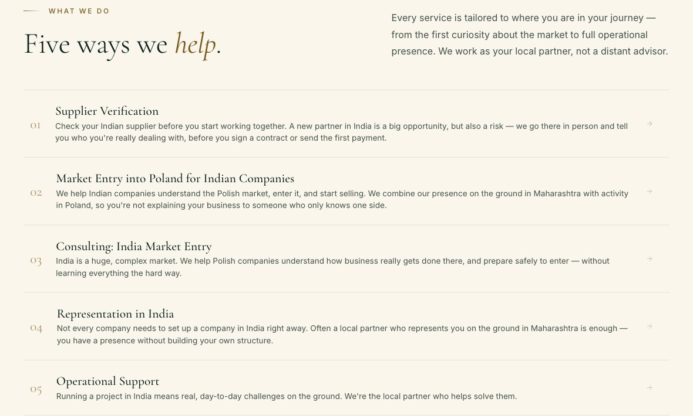
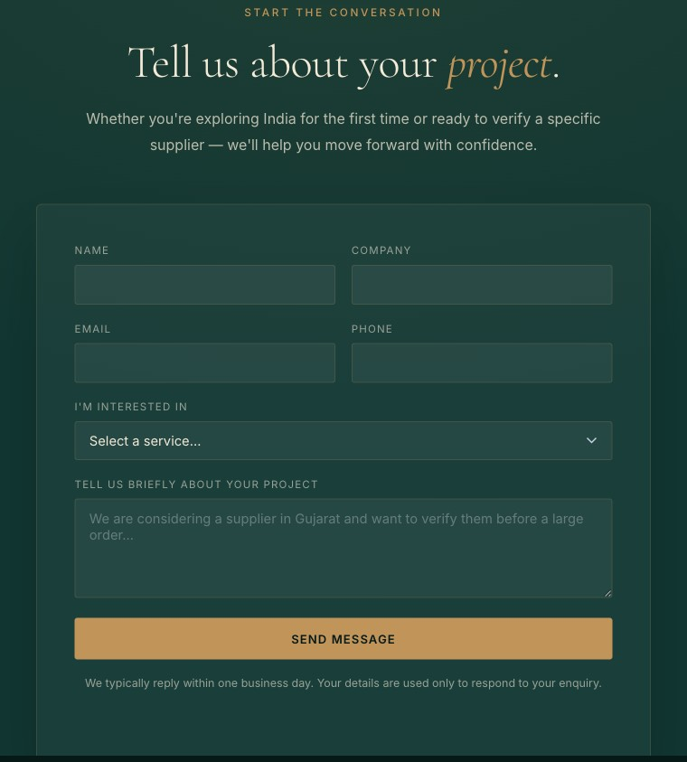

# Valeris Website

Static website for Valeris Group Private Limited, a Poland-India market-entry and supplier-verification consultancy.

The site has three pages:

- `index.html` - main Valeris landing page
- `india.html` - English-only page for Indian companies entering Poland/Europe
- `pharma.html` - pharma-focused Europe market-entry page

The project uses plain HTML, CSS, and vanilla JavaScript. There is no framework, package manager, bundler, or build step.

## Features

- responsive three-page static website
- shared design system in `assets/css/styles.css`
- bilingual EN/PL content on `index.html` and `pharma.html`
- English-only `india.html`
- contact form with Google Sheets CRM integration
- GA4 support through deployment config
- self-hosted fonts
- SEO metadata, `robots.txt`, and `sitemap.xml`
- Apache/cPanel `.htaccess` for compression, caching, and basic security headers

## Project Structure

```text
.
├── index.html
├── india.html
├── pharma.html
├── robots.txt
├── sitemap.xml
├── .htaccess
├── assets/
│   ├── css/
│   │   ├── fonts.css
│   │   └── styles.css
│   ├── js/
│   │   ├── config.js
│   │   ├── i18n.js
│   │   └── main.js
│   ├── fonts/
│   └── img/
├── apps-script/
│   └── Code.gs
└── docs/
    ├── crm-setup.md
    └── screenshots/
```

The source files in the repository root are directly deployable — no build step required.

## Local Development

Serve the folder with any static server:

```bash
python3 -m http.server 8080
```

Then open:

```text
http://localhost:8080
```

Edit the HTML, CSS, and JS files directly. There is no compilation step.

## Configuration

Deployment-specific values live in `assets/js/config.js`:

```js
window.VALERIS_CONFIG = {
  ga4Id: '',
  crmEndpoint: '',
  canonicalBase: 'https://www.valeris.com.in'
};
```

- `ga4Id`: Google Analytics 4 Measurement ID. Leave empty to disable analytics.
- `crmEndpoint`: Google Apps Script Web App URL for the contact form CRM.
- `canonicalBase`: production origin used as the canonical domain reference.

If `crmEndpoint` is empty, the contact form shows a configuration error instead of reporting a successful submission.

## Google Sheets CRM

The contact form posts leads to a Google Sheets CRM through `apps-script/Code.gs`.

The Apps Script creates:

- `Leads` tab for submitted enquiries
- `Dashboard` tab with lead totals by status and service interest
- `README` tab inside the Sheet
- dropdowns for `Status`, `Priority`, and `Interest`
- status and priority color rules
- automatic `Last Updated` changes when a lead row is edited

Captured lead data:

- first name, last name, full name
- company, email, phone
- service interest
- message
- language, page URL, referrer, device, user agent
- UTM source, medium, and campaign
- CRM fields such as owner, status, priority, next action, next action date, and notes

Setup steps:

1. Create a Google Sheet in the client's Google account.
2. Open `Extensions -> Apps Script`.
3. Paste the contents of `apps-script/Code.gs`.
4. Optional: set `NOTIFY_EMAIL` near the top of `Code.gs`.
5. Run `setupCrm()` once and approve permissions.
6. Deploy as a Web App.
7. Use `Execute as: Me`.
8. Use `Who has access: Anyone`.
9. Copy the Web App URL into `assets/js/config.js` as `crmEndpoint`.
10. Submit a test lead from the website and confirm it appears in the `Leads` tab.

More detail: [docs/crm-setup.md](docs/crm-setup.md).

## Deployment

For Apache/cPanel hosting, deploy:

```text
index.html
india.html
pharma.html
robots.txt
sitemap.xml
.htaccess
assets/
```

For static hosts such as Netlify, Vercel, GitHub Pages, Cloudflare Pages, or S3, deploy the same files. The Apache-only `.htaccess` file can be ignored by those platforms.

Before deployment:

1. Confirm the production domain in metadata, sitemap, and `assets/js/config.js`.
2. Set `crmEndpoint` if the contact form should collect leads.
3. Set `ga4Id` if analytics should be enabled.
4. Submit a test lead.
5. Check `index.html`, `india.html`, and `pharma.html` on desktop and mobile widths.

## Screenshots






## License

MIT. See [LICENSE](LICENSE).
